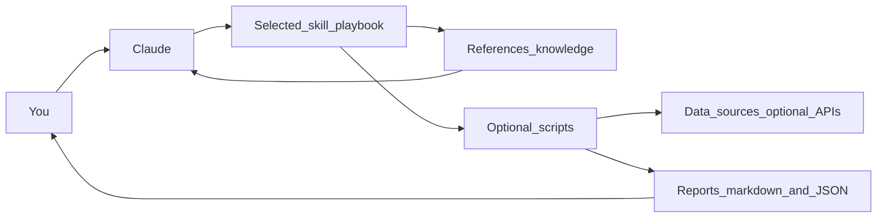

# Understand This Repo (Plain English)

This repository is a **library of “Claude Skills”** for people who invest in, or trade, US stocks.

If you are new to the idea of “skills,” think of them as **plug‑in playbooks** for an AI assistant:
- They tell Claude *how to think and what steps to follow* for a specific job (like screening stocks, analyzing market breadth, or preparing an earnings calendar).
- Some skills include small helper programs (Python scripts) to fetch data and generate reports.

This repo is **not** an automated trading bot. It is a structured set of instructions, reference notes, and optional scripts that help you do research and decision support.

## The big idea: what you get from this repo

- **Consistent workflows**: repeatable checklists and frameworks so you do not “wing it.”
- **Reusable knowledge**: built-in reference material Claude can consult during analysis.
- **Optional automation**: scripts that can fetch data (sometimes via paid APIs) and produce report files.

## What is a “skill” (in this repository)?

Each skill lives in its own folder under `skills/`.

At a high level, a skill usually contains:
- `SKILL.md`: the **main playbook** Claude reads to know what to do.
- `references/`: **background reading** Claude can pull in when needed (frameworks, methodology, templates).
- `scripts/`: **optional Python tools** that can fetch data, compute scores, or generate reports.
- `assets/`: templates and resources used for output generation (when present).

Claude Code loads skills progressively:
1. It reads the **metadata** (so it can detect the skill).
2. It loads the skill’s instructions when you invoke it.
3. It loads reference files only if they are needed.
4. It runs scripts only if asked to do so.

## How things fit together (simple mental model)

In plain terms:
- You ask a question (or provide inputs like tickers, CSVs, or chart images).
- A skill tells Claude what process to follow.
- Some skills can run scripts to pull data and produce files (often reports).
- You get a structured, human-readable answer (and sometimes saved report files).

## Repository map (where to look)

- `skills/`: the main “product.” Each folder here is one skill (one capability).
- `skill-packages/`: pre-built `.skill` archives you can upload to Claude’s web app.
- `docs/`: the documentation website source (English + Japanese).
- `scripts/` (repo root): maintenance tools for the project (for example, documentation generation).
- `CLAUDE.md`: contributor-focused guidance for how this repository is organized and how skills should be authored.

## What kinds of skills exist here (grouped for humans)

There are many skills (dozens). You do not need to memorize them. A practical way to understand the collection is to group them by the question you are trying to answer.

### 1) “Is the market healthy right now?”

These skills help you decide whether the overall market is supportive or risky.

Examples:
- `market-breadth-analyzer`, `uptrend-analyzer`, `breadth-chart-analyst`
- `macro-regime-detector`, `market-top-detector`, `ftd-detector`

### 2) “What’s driving markets this week?”

These skills help you summarize and interpret macro conditions and news flow.

Examples:
- `market-news-analyst`, `market-environment-analysis`
- `sector-analyst`, `theme-detector`

### 3) “Which stocks should I look at?”

These skills help you build candidate lists using different styles (growth, value, patterns, earnings effects).

Examples:
- `vcp-screener`, `canslim-screener`
- `value-dividend-screener`, `dividend-growth-pullback-screener`
- `earnings-trade-analyzer`, `pead-screener`
- `institutional-flow-tracker`

### 4) “How big should my position be, and what’s the risk?”

These skills help you translate an idea into a risk-sized trade plan.

Examples:
- `position-sizer`, `options-strategy-advisor`
- `exposure-coach` (a higher-level “how much equity exposure should I have?” synthesis)

### 5) “Help me do research and write it down”

These skills help you create structured analysis, memos, or scenario plans.

Examples:
- `us-stock-analysis`, `scenario-analyzer`, `technical-analyst`

### 6) “I want a full research pipeline, not one-off answers”

There is a set of “edge” skills intended to turn observations into reproducible strategy work products.

Examples:
- `edge-hint-extractor`, `edge-concept-synthesizer`, `edge-strategy-designer`
- `edge-strategy-reviewer`, `edge-candidate-agent`, `edge-pipeline-orchestrator`
- `edge-signal-aggregator`, `signal-postmortem`

### 7) “I focus on dividend investing and want a repeatable routine”

There is a dedicated workflow stack for dividend processes (including monitoring and tax/account decisions).

Examples:
- `kanchi-dividend-sop`, `kanchi-dividend-review-monitor`, `kanchi-dividend-us-tax-accounting`

### 8) “I’m building or testing skills (meta tools)”

These skills help maintain and validate the skill ecosystem.

Examples:
- `skill-designer`, `skill-idea-miner`, `skill-integration-tester`, `dual-axis-skill-reviewer`

## How you use this repository (two common ways)

### Option A: Use with the Claude Web App

Use the pre-built packages:
1. Pick a `.skill` file from `skill-packages/`.
2. In Claude web: **Settings → Skills**, upload the file.
3. Enable that skill in the conversation where you want to use it.

### Option B: Use with Claude Code (desktop/CLI)

Use the source skill folders:
1. Copy a folder from `skills/<skill-name>/` into your Claude Code Skills directory.
2. Restart or reload Claude Code so it detects the new skill.
3. Trigger it by asking for something that matches the skill’s description.

The web packages and the source folders contain the same kind of content; the difference is simply *how you install them*.

## Data, API keys, and costs (important)

Some skills can work fully offline or with free public data. Others rely on external data providers.

Common examples mentioned in this project:
- **FMP (Financial Modeling Prep)**: used by several screeners and data-fetching scripts.
- **FINVIZ / FINVIZ Elite**: used by theme/screener workflows (some features optional).
- **Alpaca**: used for portfolio/holdings workflows (requires an account if you want live integration).

If a skill needs an API key, it will usually say so in its documentation, and the contributor guidance in `CLAUDE.md` discusses API key management at the project level.

## “Reports” and outputs (what gets saved)

Many skills produce a human-readable analysis in chat. Some scripts can additionally save files like:
- Markdown reports (easy to read and share)
- JSON outputs (easy to feed into other tools or skills)

By convention in this repository, generated reports are saved under a `reports/` directory when scripts are executed.

## What you should read next (recommended order)

1. `README.md` for the catalog and basic usage.
2. `docs/` (or the published documentation site) for deeper guides.
3. `CLAUDE.md` if you want to contribute, modify, or add new skills.

## Tiny glossary

- **Skill**: a packaged “playbook” for Claude: instructions + references + optional scripts.
- **Screener**: a tool that filters a large list of stocks down to a short list based on rules.
- **Market breadth**: a way of asking “how many stocks are participating?” (broad participation is usually healthier than a rally driven by only a few names).
- **API key**: a secret token that lets scripts access a data provider you pay for or have an account with.

